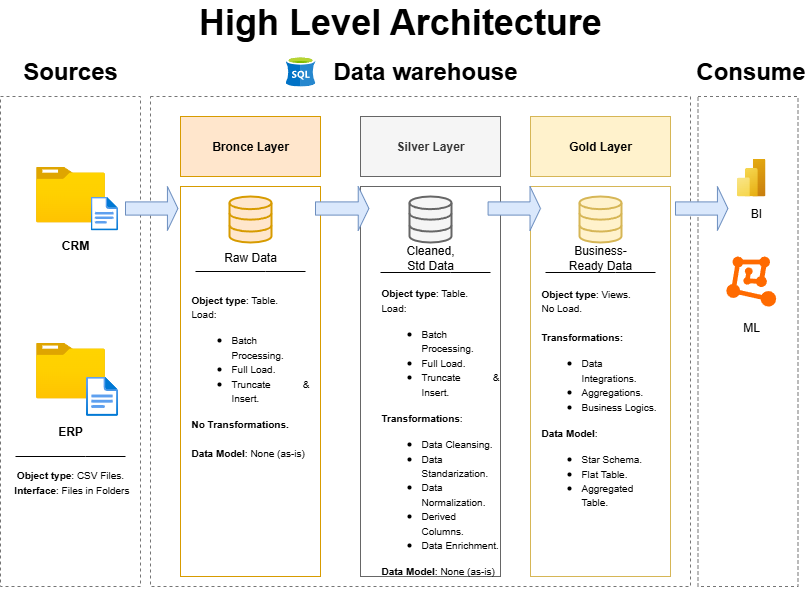

# SQL_Project_data_warehouse

Welcome to the **Data Warehouse and Analytics Project** repository! 🚀  
This project showcases a comprehensive data warehousing and analytics solution, from building a data warehouse to generating actionable insights. Designed as a portfolio project, it highlights industry best practices in data engineering and analytics.

---

## 🏗️ Data Architecture

The data architecture for this project follows Medallion Architecture **Bronze**, **Silver**, and **Gold** layers:

1. **Bronze Layer**: Stores raw data as-is from the source systems. Data is ingested from CSV Files into SQL Server Database.
2. **Silver Layer**: This layer includes data cleansing, standardization, and normalization processes to prepare data for analysis.
3. **Gold Layer**: Houses business-ready data modeled into a star schema required for reporting and analytics.

---

# General Principles:

- Naming Convetions: snake_case, with lowercase letters and underscores (_) to separate words. 
- Example: customer_info ← Lowercase | Underscor | Lowercase.
- Language: Use English for names. Spanish/English for comments.
- Avoid Reserved Words: Do not use SQL reserved Words as object Names.

# Table Naming Conventions.

**Bronze Rules** 
 
