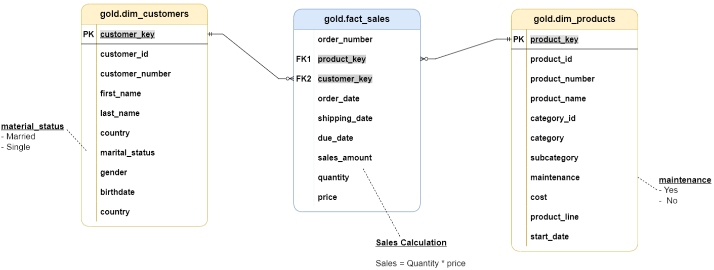

# SQL_Project_data_warehouse

Welcome to the **Data Warehouse and Analytics Project** repository! 🚀  
This project showcases a comprehensive data warehousing and analytics solution, from building a data warehouse to generating actionable insights. Designed as a portfolio project, it highlights industry best practices in data engineering and analytics.

---

## 🏗️ Data Architecture

The data architecture for this project follows Medallion Architecture **Bronze**, **Silver**, and **Gold** layers:

1. **Bronze Layer**: Stores raw data as-is from the source systems. Data is ingested from CSV Files into SQL Server Database.
2. **Silver Layer**: This layer includes data cleansing, standardization, and normalization processes to prepare data for analysis.
3. **Gold Layer**: Houses business-ready data modeled into a star schema required for reporting and analytics.

---

# General Principles:

- Naming Convetions: snake_case, with lowercase letters and underscores (_) to separate words. 
- Example: customer_info ← Lowercase | Underscor | Lowercase.
- Language: Use English for names. Spanish/English for comments.
- Avoid Reserved Words: Do not use SQL reserved Words as object Names.

## 📖 Project Overview

This project involves:

1. **Data Architecture**: Designing a Modern Data Warehouse Using Medallion Architecture **Bronze**, **Silver**, and **Gold** layers.
2. **ETL Pipelines**: Extracting, transforming, and loading data from source systems into the warehouse.
3. **Data Modeling**: Developing fact and dimension tables optimized for analytical queries.
4. **Analytics & Reporting**: Creating SQL-based reports and dashboards for actionable insights.

# **Bronze Layer** 

Store raw data as-is from the source systems. Data is ingested from CSV files into SQL Server.

We used the bulk insert option from SQL to populate our tables. The tables are created to correspond to the tables needed. At the same time, we created Procedures to facilitate future updates.

**Final documents:**
- Creation of tables.
- Bulk insert of information.
- Creation of BRONZE procedure to facilitate future inserts or new information.

**Queries:**
- scripts/bronze/proc_load_bronze.sql

This stored procedure loads data into the 'bronze' schema from external CSV files. It performs the following actions:
    - Truncates the bronze tables before loading data.
    - Uses the `BULK INSERT` command to load data from csv Files to bronze tables.
 

- scripts/bronze/ddl_bronze.sql

This script creates tables in the 'bronze' schema, dropping existing tables if they already exist. Run this script to re-define the DDL structure of 'bronze' Tables

# **Silver Layer** 

This layer includes data cleansing, standardization, and normalization processes to prepare data for analysis.

Re-define the tables from bronze structure. Change the data types and the information needed.

**Final documents:**

- Creation of SILVER procedure to facilitate future inserts, transformed and cleansed data from Bronze into Silver tables.

**Querires:**

 - scripts/silver/ddl_silver.sql

This script creates tables in the 'silver' schema, dropping existing tables if they already exist. Run this script to re-define the DDL structure of 'bronze' Tables

- scripts/silver/proc_load_silver.sql 
    
 This stored procedure performs the ETL (Extract, Transform, Load) process to populate the 'silver' schema tables from the 'bronze' schema.
 
Actions Performed:
		- Truncates Silver tables.
		- Inserts transformed and cleansed data from Bronze into Silver tables.
  

# **Gold Layer** 

This script creates views for the Gold layer in the data warehouse. The Gold layer represents the final dimension and fact tables (Star Schema). Each view performs transformations and combines data from the Silver layer to produce a clean, enriched, and business-ready dataset.

*Dimensions created:*

- Gold.dim_customers
	- The customer dimension has all the information related to each customer.

- Gold.dim_products
  	- The product dimension has all the information related to each product available. 

*Fact table created:*

- Gold.fact_sales
	- The fact table is the summary of each transaction done. The table contains all the information about all the purchases and of each of the customers. The relationship between the dim and the fact table is 1 to many. You can have only 1 of each in the dimension tables, but in the fact table, you are going to have multiple of each.
   		- Example: You can have multiple purchases, but there's not only 1 user with the same information. 

 

**Final documents:**

- View: Gold.dim_customers.
- View: Gold.dim_products.
- View: Gold.fact_sales.

You can access the information of these views and perform EDA analysis with this.

 # **Final Data Flow Diagram** 

images/data_flow_diagram.png

Final results:

Create an ETL process to handle all the information in 3 different layers (Bronze, Silver, and Gold). Having these 3 layers allows you to have a more transparent and easier way to process the information. In case of a mistake, you can troubleshoot easily thanks to knowing what happens in each of the steps. And, in case there is a change o something needs to be added, you can follow the same steps to change it.

Creating an ETL process allows you to facilitate the extraction, transformation, and loading of the information to be ready to use for an EDA analysis.
